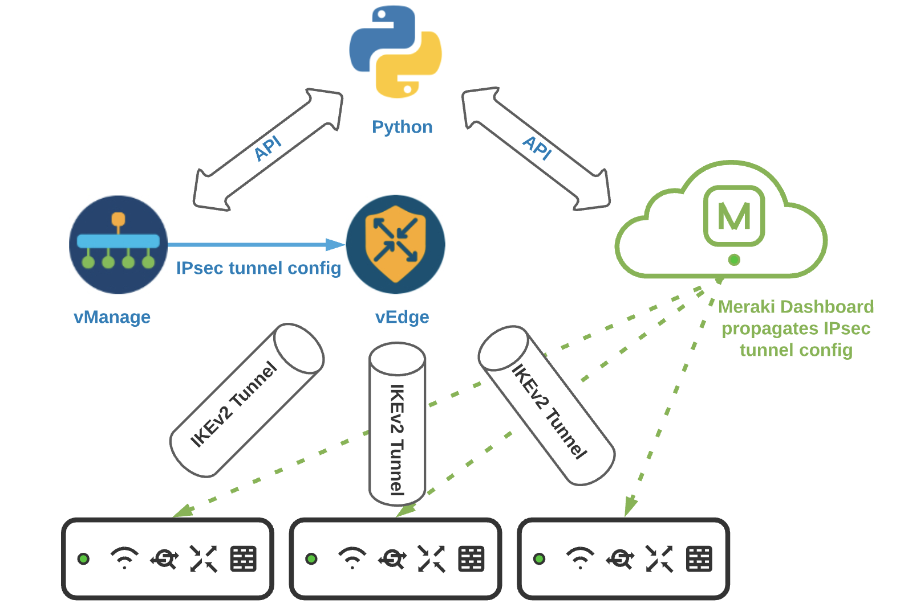

# Viptela Meraki Integration

# Objective 

*   How to use vManage REST APIs to configure IPsec tunnel from vEdge router to Meraki MX routers. 
*   How to use Meraki APIs to create VPN endpoint configuration on  MX router.

# Requirements

To use this code you will need:

* Python 3.7+
* vManage user login details. (User should have privilege level to configure feature templates and edit device template)
* vEdge routers with device template attached.

# Install and Setup

- Clone the code to local machine.

```
https://github.com/suchandanreddy/viptela-meraki-integration.git
cd viptela-meraki-integration
```
- Setup Python Virtual Environment (requires Python 3.7+)

```
python3.7 -m venv venv
source venv/bin/activate
pip3 install -r requirements.txt
```

# Architecture



1) Obtain Cisco Meraki API Key and Org Name

    a) The API Key and Org Name will be needed for the script to configure your Meraki device. 

    b) To view your Organization name navigate to Organization > Settings, the name will be displayed at the top. (As seen below)
    
    c) For access to the API, first enable the API for your organization. 

    d) Navigate to Organization > Settings > Dashboard API access 

    e) Enable the API 
    
    f) Navigate to the my profile page and generate an API key 

     Note: The API key is associated with a Dashboard administrator account.   

- Create config_details.yaml using below sample format to update the environment variables for vManage, Meraki Dashboard login details and tunnel parameters

## Example:


```
# vManage Connectivity Info
vmanage_host: 
vmanage_port: 
vmanage_username: 
vmanage_password: 

# Meraki API keys

api_key: 
orgName: 

# Viptela device template Info

device_template_name:

# Viptela Routers
vip_devices:
  - system_ip: 
    vpn0_source_interface: 
    #pri_ipsec_ip: 
    #sec_ipsec_ip: 
    #pri_ipsec_id: 
    #sec_ipsec_id: 
    vedge_lan_prefix: 
    ike_cipher_suite: 
    ike_dh_group: 
    ipsec_cipher_suite:
    ipsec_pfs:
```

After setting the env variables, run the python script `viptela-mx-ipsec-tunnel.py`

`viptela-mx-ipsec-tunnel.py` script does the below steps in sequence. 

## Workflow

### Cisco vManage APIs Workflow:

- Fetch the device template-id associated with the device template name.
- Retrieve feature templates associated with this device template.
- Create IPsec feature template with device specific variables for IKE and IPsec ciphers to be used for IPsec tunnel.
- Attach the new IPsec feature template to device templates.
- Add the device specific variable values for IPsec tunnel source address, tunnel destination address, pre-shared key and default IKE, IPsec parameters. 
- Push the updated template to all the devices attached to the Device template.
- In the end, IPsec tunnel would be configured between vEdge and Meraki router and Service side IPsec routes are added to use the IPsec tunnel for LAN side traffic between vEdge and Meraki routers

# Cisco Meraki Workflow 

Initially, there will be no tagged Meraki networks so the script will sleep and perform the same GET to obtain any networks with the relevant tag. In order to deploy a new branch, the user would navigate to Organization > Overview and select the checkbox next to the network that you wish to connect. 

Once the network is tagged appropriately, connectivity is then automatically established. Site1 will be named Site1 in both the Vmanage and Meraki dashboard. Additionally, a site to site VPN will appear on the site to site VPN page. (As seen below)

Note: The script also assumes VPN is already turned on for the specific MX. For the tunnel to come up, interesting traffic needs to be generated.

Once interesting traffic has been generated, the tunnel will appear up in both the Meraki and Vmanage Dashboards.

Additionally, in the Meraki Event Log, a event with a timestamp is generated when the tunnel becomes established:

# Additional References 

https://documentation.meraki.com/zGeneral_Administration/Organizations_and_Networks/Organization_Menu/Manage_Tags 

https://documentation.meraki.com/zGeneral_Administration/Support/Contacting_Support